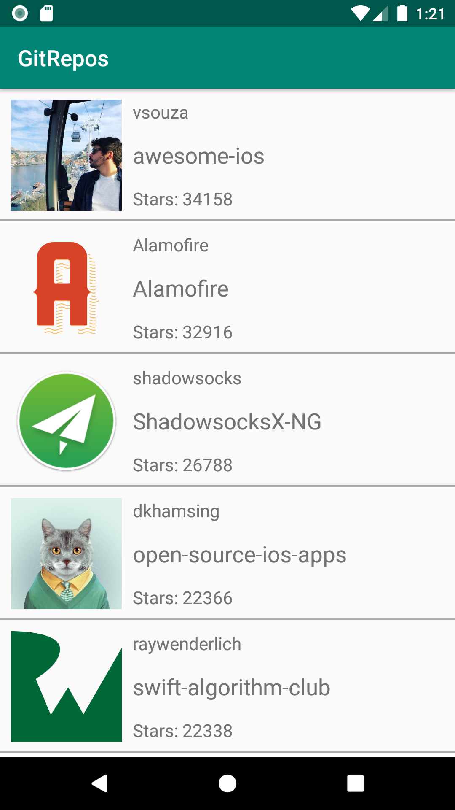

## Desafio-Liket

App para exibir dados de repositórios do GitHub.

  

---

### Dependências

**[RetroFit + Gson Converter](https://github.com/square/retrofit)** (v2.6.0)

**[RxKotlin](https://github.com/ReactiveX/RxKotlin)** (v2.4.0)

